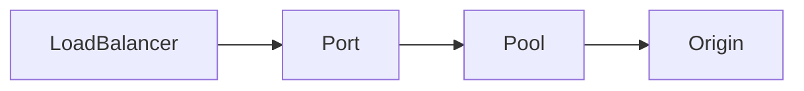

# Load Balancer API

Load Balancer API implemented in GraphQL that provides a way to manage and control load balancers using GraphQL queries and mutations. Load Balancers are one subgraph of the Infratographer [federated API](https://www.apollographql.com/docs/federation/). The GraphQL API provides an efficient and precise data retrieval for the related compenents that are external to Load Balancers subgraph, such as [Tenants](https://github.com/infratographer/tenant-api) and [Locations](https://github.com/infratographer/location-api).

## Load Balancer Components

### Load Balancers

Load Balancers are the top level component managed by the load balancer API. Load balancers are assigned to an owner (tenant).

### Ports

Ports define the listening port of a load balancer. Ports share edges to load balancers and pools.

### Pools

Pools are a collection of origins. Pools are own by an owner (tenant), and share an edge to ports. Pools can be assigned to multiple port and load balancer pairs.

### Origins

Origins define a backend service IP and port. Origins belong to a pool. Origins can have a weight from 0 to 100, these weights are a relative to one another in a given pool. A wieght of 0 means the origin is disabled.

## Development and Contributing

- [Development Guide](docs/development.md)
- [Contributing](https://infratographer.com/community/contributing/)

## Code of Conduct

[Contributor Code of Conduct](https://infratographer.com/community/code-of-conduct/). By participating in this project you agree to abide by its terms.

## Contact

To contact the maintainers, please open a [GithHub Issue](https://github.com/infratographer/load-balancer-api/issues/new)

## License

[Apache License, Version 2.0](LICENSE)
